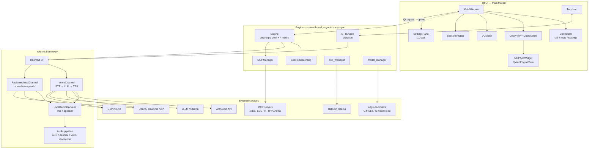

# Architecture

> _Generated: 2026-06-11 — re-run /project-review to update_

RoomKit UI is a single-process desktop voice assistant. A PySide6 (Qt 6) GUI and an
asyncio engine share one thread through [qasync](https://github.com/CabbageDevelopment/qasync),
which drives the Qt event loop and the asyncio event loop as one. All voice, AI, and
audio-pipeline work is delegated to the [RoomKit](https://github.com/roomkit-live/roomkit)
framework; the app's job is wiring RoomKit's async events into Qt signals and back.

See [technical.md](technical.md) for implementation details, [features.md](features.md)
for user-facing behavior, and [onboarding.md](onboarding.md) to get a dev environment running.

## High-level overview

## Component breakdown

| Component | Files | Responsibility |
|---|---|---|
| **App bootstrap** | `app.py` | QApplication + qasync loop, OpenGL/software-rendering probe, Chromium flags, logging, hotkey listeners, tray |
| **Engine shell** | `engine.py` | Session lifecycle (`start`/`stop`), state machine (`idle/connecting/active/stopping/error`), model caching across sessions, cleanup orchestration |
| **Engine mixins** | `engine_vc.py`, `engine_realtime.py`, `engine_tools.py`, `engine_callbacks.py` | Mode-specific session builders, tool dispatch, provider→Qt callbacks. Mixins hold no state — all attributes live on `Engine` |
| **Audio builders** | `engine_audio.py` | AEC/denoiser/VAD/diarization/recorder/telemetry pipeline construction shared by both modes |
| **Hooks** | `hooks.py` | RoomKit hook registration (transcription, audio levels, speaker change, primary-speaker gating) |
| **Watchdog** | `watchdog.py` | Detects stalled sessions (8 s silence, 90 s when tools are pending) and nudges the model |
| **Cleanup** | `cleanup.py` | 4-layer purge of orphaned qasync/anyio timers and FD notifiers after MCP disconnect (prevents 100 % CPU) |
| **Dictation** | `stt_engine.py`, `hotkey.py`, `paste.py`, `tray.py` | Global hotkey → STT recording (OpenAI/local/Deepgram) → clipboard paste into the focused app |
| **Speakers** | `speaker_manager.py`, `enrollment.py` | Speaker profile persistence (JSON) and embedding extraction for diarization |
| **MCP** | `mcp_manager.py`, `mcp_auth.py`, `mcp_app_bridge.py` | MCP server connections (stdio/SSE/HTTP), OAuth2 flow, JSON-RPC bridge for MCP App HTML UIs |
| **Skills** | `skill_manager.py`, `skills_sh_client.py` | Skill discovery from git/local sources, skills.sh search, registry building via `roomkit.skills` |
| **Models** | `model_manager.py` | Download/manage local STT/TTS/VAD/speaker/denoiser models (GitHub LFS resolution) |
| **Providers** | `providers/`, `tts/` | Lazy factory registries for LLM providers and TTS backends |
| **Widgets** | `widgets/` | Main window, chat, VU meter, control bar, 11-tab settings panel |

## Data flow

### Voice session (both modes)

1. `ControlBar` emits `start_requested` → `MainWindow` → `Engine.start(settings)`.
2. The engine builds the session from settings:
   - **Voice Channel mode** (`engine_vc.py`): STT provider (sherpa-onnx / Gradium / Deepgram) + LLM provider (Anthropic / OpenAI / Gemini / local) + TTS provider (Piper / Qwen3 / NeuTTS / Gradium / ElevenLabs) composed into a `VoiceChannel`.
   - **Realtime mode** (`engine_realtime.py`): `GeminiLiveProvider` or `OpenAIRealtimeProvider` in a `RealtimeVoiceChannel`.
3. Both modes share `LocalAudioBackend` (mic/speaker) and the audio pipeline built by `engine_audio.py` (AEC, denoiser, VAD, optional diarization with enrolled speakers).
4. MCP tools are discovered via `MCPManager` and exposed to the model; built-in tools (`builtin_tools.py`) are checked first at dispatch time. If the provider rejects MCP tools, the realtime path retries with built-in tools only.
5. RoomKit hooks (`hooks.py`) and provider callbacks (`engine_callbacks.py`) translate framework events into Qt signals: `transcription`, `mic_audio_level`, `speaker_audio_level`, `speaker_identified`, `tool_use`, `state_changed`, `error_occurred`.
6. `Engine.stop()` runs a carefully ordered teardown (see `engine.py:_cleanup`): stop listening → detach STT/TTS → `kit.close()` → detach backend → close MCP → cancel lingering tasks → purge stale qasync timers/FDs.

### Dictation

Global hotkey (NSEvent on macOS, pynput elsewhere) → `STTEngine` records through a short-lived RoomKit session → final transcription → clipboard copy + paste simulation (AppleScript / xdotool / wtype) into whatever app has focus.

### MCP Apps

A tool result carrying a `ui://` resource URI triggers `MainWindow._fetch_and_show_app`: the HTML is fetched over MCP, rendered in a sandboxed `QWebEngineView`, and wired to Python over QWebChannel JSON-RPC (`mcp_app_bridge.py`). App-initiated `tools/call` requests are proxied back through the engine's MCP path.

## External integrations

- **AI providers**: Gemini Live + Gemini API, OpenAI Realtime + API, Anthropic API, vLLM/Ollama-compatible local endpoints, ElevenLabs/Gradium/Deepgram for voice.
- **MCP servers**: user-configured, three transports (stdio subprocess, SSE, streamable HTTP), OAuth2 with a localhost callback server for HTTP servers.
- **skills.sh**: public search endpoint used from settings; GitHub-backed results
  install through explicit git sources, while well-known results are downloaded into
  local skill folders after index/path validation.
- **edge-ai-models (GitHub)**: model distribution repo; downloads resolve Git LFS pointers to S3 URLs.

## Infrastructure & deployment

There is no server component. Distribution is a PyInstaller bundle built by GitHub Actions
(`.github/workflows/build.yml`) for macOS (DMG, signed + notarized), Linux (tar.gz), and
Windows (ZIP). CI (`ci.yml`) runs ruff, format checks, bandit, mypy, and pytest (see
[technical.md — Testing](technical.md#testing-strategy)).

## Security architecture

- **API keys, OAuth tokens, MCP OAuth client secrets, and secret-looking MCP env values** are stored via `SecretStore`: OS keyring first, with a QSettings fallback when no keyring backend is usable.
- **MCP stdio servers** are launched as subprocesses from user-entered commands (list form, no shell). The SDK inherits only a small default environment; RoomKit UI passes only explicitly configured env values, with secret-like values removed from plaintext settings.
- **Skills are arbitrary code/instructions** loaded from git repos or local folders. skills.sh is used for discovery; GitHub-backed marketplace results become explicit Git sources, and well-known marketplace results become local sources. v0.2 `skill-md` well-known artifacts are checked against their SHA-256 digest, but legacy `files[]` well-known sources do not provide signatures — installation is still the trust decision.
- **MCP App HTML** runs inside QWebEngineView with a JSON-RPC bridge; app-initiated tool calls are limited to the owning MCP server, and `webbrowser.open` calls from apps are restricted to public http/https URLs.
- Input boundaries: tool arguments arrive as JSON and are passed to MCP servers verbatim; built-in tools validate their own inputs.

Known gaps (documented honestly): model downloads have no checksum verification. See
[technical.md — Technical debt](technical.md#known-technical-debt).

## Scalability considerations & current limits

- **One voice session at a time** — enforced by the engine state machine; a second `start()` while non-idle is ignored.
- **Single process, single thread** for UI + async; blocking work (model downloads, paste subprocesses) is pushed to executor threads.
- Local models are cached across sessions (STT/TTS/diarization keyed by config) to avoid multi-second reload on every call.
- The fixed 420×700 window and single-room design are deliberate product constraints, not technical ones.
