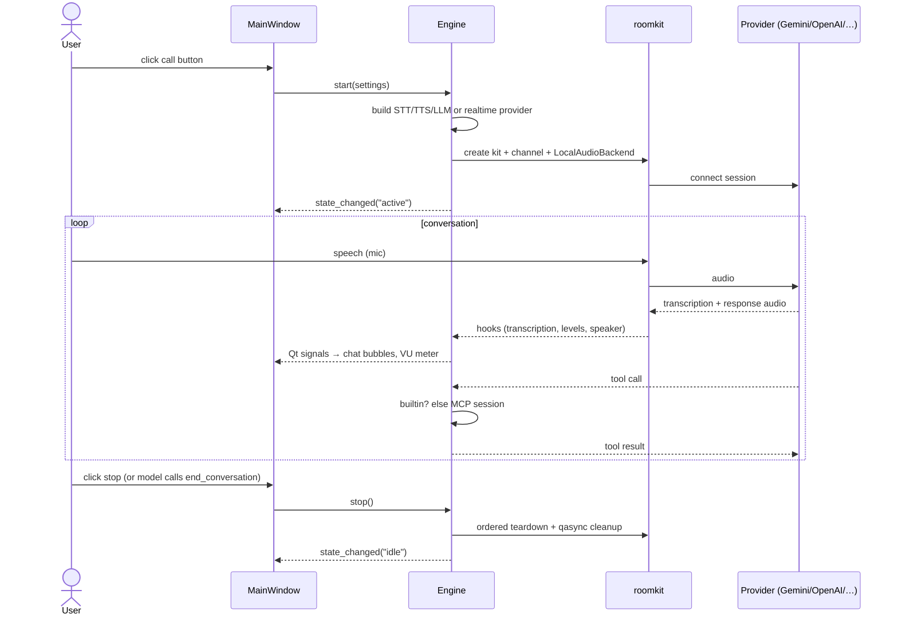
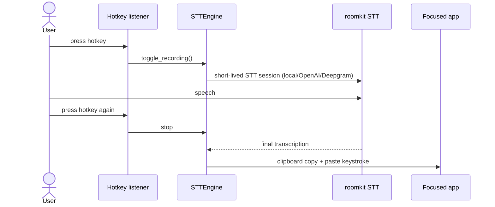

# Features

> _Generated: 2026-06-11 — re-run /project-review to update_

Implementation details for each feature are in [technical.md](technical.md);
system context in [architecture.md](architecture.md).

## Core features

### Voice conversation — two modes

| | Realtime (speech-to-speech) | Voice Channel (STT → LLM → TTS) |
|---|---|---|
| Providers | Gemini Live, OpenAI Realtime | LLM: Anthropic, OpenAI, Gemini, local (vLLM/Ollama) |
| STT | provider-native | sherpa-onnx (local), Gradium, Deepgram |
| TTS | provider-native | Piper (local), Qwen3-TTS & NeuTTS (voice clone), Gradium, ElevenLabs |
| Latency | lowest | depends on the three stages |
| Offline capable | no | yes (local STT + local LLM + Piper) |
| Code | `engine_realtime.py` | `engine_vc.py` |

Both modes share: echo cancellation (WebRTC/Speex), noise suppression (RNNoise/GTCRN),
VAD (TEN/Silero), barge-in interruption, optional WAV recording, optional speaker
diarization, MCP + built-in tools, skills, and attitudes.

### System-wide dictation

Press a global hotkey anywhere in the OS, speak, release — the transcription is pasted
into the focused application. STT can be local (sherpa-onnx models), OpenAI, or
Deepgram. A tray icon shows recording state. (`stt_engine.py`, `hotkey.py`, `paste.py`)

### Speaker diarization & primary-speaker mode

Enroll speakers from a 10 s recording (split into overlapping windows for robust
embeddings). During sessions the active speaker is identified and labeled in the chat;
*primary speaker mode* makes the assistant respond only to the enrolled primary
speaker. (`enrollment.py`, `speaker_manager.py`, settings → Speakers)

### Tools: MCP + built-ins + MCP Apps

- **Built-in tools** (always available): date/time, attitude switching, clipboard paste,
  end-conversation. (`builtin_tools.py`)
- **MCP servers**: stdio / SSE / streamable-HTTP transports, OAuth2 for HTTP servers,
  configured in settings → MCP. Tool calls from the model are routed builtin-first,
  then to the owning MCP session. (`mcp_manager.py`)
- **MCP Apps**: tools that declare a `ui://` resource render their HTML UI inline in
  the chat (QWebEngineView + JSON-RPC bridge) and can call tools back through the app.
  (`mcp_app_bridge.py`, `widgets/mcp_app_widget.py`)

### Skills & attitudes

- **Skills**: instruction packages discovered from git repos or local folders;
  settings can search skills.sh through its public search endpoint. GitHub-backed
  results install as explicit Git sources; well-known results install into local
  skill folders after validating the public discovery index, then skills are enabled
  per-skill and registered into roomkit's `SkillRegistry`. (`skill_manager.py`,
  `skills_sh_client.py`)
- **Attitudes**: persona presets (plus user-defined ones) appended to the system prompt;
  switchable mid-session by the user *or by the model itself* via the `set_attitude`
  tool. (`engine_tools.py`)

### Local model management

Settings → Models downloads and manages local models: STT (Whisper, Parakeet, Zipformer,
Kroko-FR), TTS (3 Piper French voices), VAD (TEN, Silero), speaker embeddings (TitaNet,
WeSpeaker, CAM++), GTCRN denoiser, smart-turn detector. Downloads resolve GitHub LFS
pointers; GPU inference (CUDA/CoreML) is selectable. (`model_manager.py`)

### UI

Fixed-size (420×700) chat window: iMessage-style bubbles with markdown, streaming
transcriptions, animated VU meter, collapsible session-info bar, dark/light themes,
synthesized start/stop sounds, session watchdog that nudges a stalled model.

## User roles & permissions

Single-user desktop app — no roles, no auth. The OS user owns all data
(settings, speaker profiles, models, tokens).

## Workflows

### Voice session

### Dictation

## Integration points

| Integration | Direction | Notes |
|---|---|---|
| Gemini Live / OpenAI Realtime | bidirectional WS | speech-to-speech |
| Anthropic / OpenAI / Gemini / vLLM / Ollama APIs | outbound | voice-channel LLM turn |
| ElevenLabs / Gradium / Deepgram | outbound | cloud TTS / STT |
| MCP servers | bidirectional | user-configured, OAuth2 for HTTP |
| skills.sh | outbound HTTPS / browser | skill search; GitHub sources install as Git, well-known sources as local folders |
| edge-ai-models GitHub repo | outbound | model downloads (LFS) |

## Current limitations

- One session at a time; no conversation history persistence between sessions.
- No text input — voice only (paste_text tool exists for the *model* to paste).
- Realtime mode requires Gemini or OpenAI; no local speech-to-speech.
- MCP Apps require QtWebEngine (graceful fallback to a plain tool pill without it).
- Window size fixed; no chat search/export.
- French-centric local TTS catalog (all three Piper voices are French).

## Potential enhancements

(Not roadmap commitments — gaps that follow naturally from the current design.)

- Conversation transcript export / history persistence.
- Keyboard accessibility on the custom-painted controls.
- Keyring-backed secret storage.
- Broader integration/UI test coverage (see [technical.md — Testing](technical.md#testing-strategy)).
- Broader local TTS catalog (English Piper voices are upstream already).
